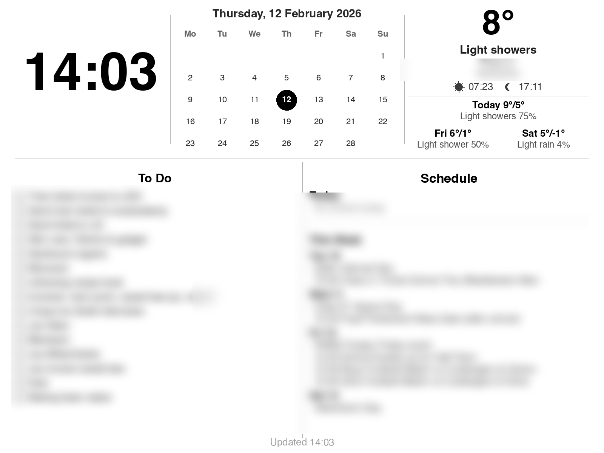

# Joan Dashboard

A custom dashboard and **playlist rotation system** for **Joan e-ink displays** (13", 6", and any Visionect-compatible size) — weather, calendar, tasks, art, quotes, and more, rendered as grayscale images and pushed via the [Visionect Software Suite (VSS)](https://docs.visionect.com/).



## Features

### Main Dashboard
- **Clock** — large time display
- **Month calendar** — compact grid with today highlighted
- **Weather** — current conditions, feels-like, sunrise/sunset icons, 3-day forecast via [Open-Meteo](https://open-meteo.com/) (free, no API key)
- **Google Calendar** — today's schedule + full week ahead from all your calendars
- **Google Tasks** — to-do list with checkboxes, dynamically fills available space
- **Room temperature** — from the Joan's built-in LM75 sensor (via VSS API)
- **Battery level** — live device battery percentage from VSS

### Playlist Screens (19 rotating screens)
- **Daily Agenda** — large-font view of today's events, readable across the room
- **Motivational Quote** — daily quote from [ZenQuotes](https://zenquotes.io/) API
- **Countdown** — days until your next calendar events ("School breaks up — Tomorrow")
- **Family Photo** — random photo from a local folder (e.g. SMB-mounted from another machine), new photo each rotation, auto-contrast enhanced for e-ink
- **Word of the Day** — vocabulary builder with pronunciation, definition, and examples from [Free Dictionary API](https://dictionaryapi.dev/)
- **This Day in History** — notable historical events from [Wikipedia](https://en.wikipedia.org/api/rest_v1/)
- **Art Gallery** — random artwork from [The Metropolitan Museum of Art](https://metmuseum.github.io/) collection, displayed with title, artist, and medium
- **Weather Radar** — live precipitation map from [RainViewer](https://www.rainviewer.com/api.html) overlaid on [OpenStreetMap](https://www.openstreetmap.org/) tiles
- **Dad Joke** — random joke from [icanhazdadjoke](https://icanhazdadjoke.com/) API, new joke each rotation
- **Year Progress** — visual progress bar showing day/percentage/quarter through the year
- **Maths Challenge** — 8 random problems (addition, multiplication, fractions, percentages, squares) for the kids
- **RSS Article** — full-screen single article view with hero image, title, and summary from any RSS feed (default: [The Verge](https://www.theverge.com/)); rotates through top 12 entries daily; configurable via `RSS_FEED_URL`
- **Stock Ticker** — live market prices and daily changes from [Yahoo Finance](https://finance.yahoo.com/), configurable tickers via `STOCK_TICKERS`
- **Google Tasks Todo** — full-screen task list with checkboxes, pulled from all your Google Tasks lists
- **Moon Phase** — drawn moon with illumination %, phase name, crater detail, and countdown to next full/new moon (pure calculation, no API)
- **Air Quality** — European/US AQI, PM2.5, PM10, NO₂, Ozone, UV Index from [Open-Meteo](https://open-meteo.com/en/docs/air-quality-api) (free, no API key)
- **Analogue Clock** — beautiful clock face with hour/minute/second hands, date window, 60 tick marks, filling the full 13" display
- **Upcoming Movies** — featured movie with poster, rating, synopsis + "also coming soon" list from [TMDB](https://www.themoviedb.org/) (free API key required via `TMDB_API_KEY`)
- **Kid Learning Card** — rotating educational cards: spelling bee, times tables, world capitals quiz, and general knowledge questions with hidden answers
- **UK Train Departures** — live departure board showing scheduled time, expected arrival, platform, destination, and operator via [Rail Data Marketplace](https://raildata.org.uk/) (free API key required via `TRAINS_API_KEY`); configurable station and destination CRS codes

### System
- **Multi-device support** — auto-discovers all allowed Joan devices from VSS; renders per-device at 1600×1200 (with device-specific battery/temperature in the footer), then LANCZOS-resizes to each device's native resolution (e.g. 1600×1200 for 13", 1024×758 for 6"). Add new devices by simply allowing them in VSS — zero code changes needed
- **Playlist rotation** — configurable screen order and interval, either via CLI or the built-in **web playlist manager** (`joan_playlist_manager.py`)
- **Smart caching** — fresh-first with stale fallback; shared calendar/tasks data across screens, per-screen TTLs (2min–12h), resilient to API outages
- **Active hours** — only refreshes during configurable hours (default: 07:00–21:00); displays a beautiful night sky sleep screen (crescent moon, stars, Zzz) overnight
- **Auto-refresh** — configurable loop interval (default: 180 seconds per screen, matching Joan's 3-min heartbeat)
- **Preview mode** — render any screen locally without pushing to the device
- **Runs on Raspberry Pi** — deploy as a systemd service alongside VSS for always-on operation

## How It Works

Joan devices are thin clients. They don't run apps — instead, they periodically poll a **Visionect Software Suite (VSS)** server for a pre-rendered image. This project:

1. Fetches weather, calendar events, and tasks from APIs
2. Renders a 1600×1200 grayscale PNG using Python Pillow (reference canvas)
3. Auto-discovers all configured devices and their native resolutions from VSS
4. LANCZOS-resizes and pushes to each device via the VSS HTTP API
5. Each Joan device picks up its correctly-sized image on the next poll cycle

## Prerequisites

| Requirement | Notes |
|---|---|
| **Joan device** | Any Joan / Visionect Place & Play e-ink display (13", 6", etc.) |
| **Raspberry Pi** (or any Linux host) | To run VSS + this dashboard |
| **Docker & Docker Compose** | For the Visionect Software Suite |
| **Micro-USB cable** | To connect Joan's FTDI serial console for server redirect (one-time) |
| **Python 3.9+** | With pip |
| **Google account** | For Calendar and Tasks integration |

## Setting Up VSS (Visionect Software Suite)

Joan devices are thin clients — they don't run apps. They connect to a **Visionect Software Suite (VSS)** server that tells them what to display. By default, Joan devices point to `getjoan.com` (the paid cloud service). We replace that with a **self-hosted VSS** on your local network — **no Joan subscription required**.

### 1. Install Docker on your Raspberry Pi

```bash
curl -fsSL https://get.docker.com | sh
sudo usermod -aG docker $USER
# Log out and back in for group change to take effect
```

### 2. Run VSS with Docker Compose

Create a `docker-compose.yml` (e.g. in `~/vss/`):

```yaml
version: "3"
services:
  postgres:
    image: postgres:13
    environment:
      POSTGRES_DB: vss
      POSTGRES_USER: vss
      POSTGRES_PASSWORD: vss
    volumes:
      - pgdata:/var/lib/postgresql/data
    restart: unless-stopped

  vss:
    image: visionect/visionect-server-v3-armhf
    ports:
      - "8081:8081"    # Management web UI
      - "11112:11112"  # Device connection (TCP)
      - "11113:11113"  # Device connection (encrypted)
    environment:
      DB_HOST: postgres
      DB_NAME: vss
      DB_USER: vss
      DB_PASS: vss
    depends_on:
      - postgres
    restart: unless-stopped

volumes:
  pgdata:
```

> **Note:** Use `visionect/visionect-server-v3-armhf` for Raspberry Pi (ARM). On x86/amd64 hosts, use `visionect/visionect-server-v3` instead.

```bash
cd ~/vss
docker compose up -d
```

Verify VSS is running by opening `http://<pi-ip>:8081` in a browser. You should see the VSS management UI. Default login is `admin` / `visionect1`.

### 3. Redirect the Joan device to your local VSS

Out of the box, Joan devices connect to `getjoan.com`. You need to point your device at your local VSS server. There are three ways to do this — all require connecting the Joan to your computer via the **Micro-USB** port (not USB-C — that's power only).

#### Option A: Joan Configurator (easiest)

Visionect provides a desktop app with a GUI for device configuration.

1. **Download Joan Configurator** from [Visionect support](https://www.visionect.com/support/) (macOS, Windows, Linux)
2. **Connect your Joan** via Micro-USB — the Configurator should detect it automatically
3. Under **Server settings**, change:
   - **Server address**: your Pi's IP (e.g. `192.168.1.100`)
   - **Server port**: `11113`
   - **Mode**: On-Premises
4. Configure **WiFi** if not already set
5. Click **Save** and **Reboot**

#### Option B: Use the included redirect script

If the Configurator isn't available or you prefer the command line, a ready-made script is included in this repo. It connects via the FTDI USB UART serial console exposed on the Micro-USB port.

```bash
pip install pyserial
# Edit LOCAL_IP and PORT in joan_redirect_and_reboot.py first
python joan_redirect_and_reboot.py
```

This will:
1. Read the current server settings
2. Set the server to your local VSS IP + port 11113
3. Save to flash
4. Reboot the device

#### Option C: Manual serial commands

Connect to the serial port with any terminal (e.g. `screen`, `minicom`, or `picocom`) at **115200 baud**:

```bash
# macOS example — your device path may differ
screen /dev/cu.usbserial-* 115200
```

Then type these commands:

```
server_tcp_get                           # show current server (e.g. we3.gw.getjoan.com 11113)
server_tcp_set 192.168.1.100 11113       # replace with your Pi's IP
flash_save                               # persist to flash
reboot                                   # reboot to connect to new server
```

> **Finding your serial port:** On macOS, look for `/dev/cu.usbserial-*`. On Linux, it's typically `/dev/ttyUSB0`. The FTDI chip appears as soon as you plug in the Micro-USB cable.

After any of these methods, the device will connect to your local VSS instead of the Joan cloud.

### 4. Verify the device appears in VSS

After rebooting, the Joan device should connect to your VSS within a minute or two.

1. Open `http://<pi-ip>:8081` in a browser
2. Go to **Devices**
3. Your device should appear with its UUID (e.g. `35005a00-0150-4d35-...`)
4. **Copy the UUID** — you'll need it for the dashboard configuration

If the device doesn't appear, check that:
- The Pi and Joan are on the same network
- Ports 11112/11113 are not blocked by a firewall
- The device is charged and powered on

## Quick Start

### 1. Clone and install

```bash
git clone https://github.com/juicecultus/joan-dashboard.git
cd joan-dashboard
python3 -m venv .venv
source .venv/bin/activate
pip install -r requirements.txt
```

### 2. Configure

```bash
cp .env.example .env
```

Edit `.env` with your values:

```env
VSS_HOST=192.168.1.100       # IP of your VSS server
DEVICE_UUIDS=uuid1,uuid2     # Comma-separated UUIDs (find in VSS web UI → Devices)
WEATHER_LAT=51.509            # Your latitude
WEATHER_LON=-0.118            # Your longitude
WEATHER_LOCATION=London       # Display name
```

**Finding your Device UUIDs:** Open the VSS web UI at `http://<VSS_HOST>:8081`, go to Devices, and copy the UUID of each Joan device. Separate multiple UUIDs with commas. If you have only one device, `DEVICE_UUID=...` (singular) also works.

### 3. Set up Google Calendar & Tasks

Create OAuth2 credentials:

1. Go to [Google Cloud Console](https://console.cloud.google.com/)
2. Create a new project (or select an existing one)
3. Navigate to **APIs & Services → Library**
4. Enable **Google Calendar API** and **Google Tasks API**
5. Go to **APIs & Services → Credentials**
6. Click **Create Credentials → OAuth client ID**
7. Application type: **Desktop app**
8. Download the JSON file and save it as `credentials.json` in this directory

Then run the authentication helper:

```bash
python joan_google_auth.py
```

This opens a browser window. Log in with the Google account whose calendar and tasks you want to display. The token is saved to `token.json` (git-ignored).

### 4. Preview

```bash
python joan_dashboard.py --preview                  # preview main dashboard
python joan_dashboard.py --screen art --preview      # preview a specific screen
python joan_dashboard.py --screen radar --preview    # preview weather radar
```

Saves a PNG locally without pushing to the device. Great for testing.

### 5. Push to Joan (single)

```bash
python joan_dashboard.py
```

### 6. Playlist rotation

```bash
# Rotate all screens (60s each):
python joan_dashboard.py --loop 60 --playlist dashboard,agenda,quote,countdown,photo,word,history,art,radar

# Just the essentials:
python joan_dashboard.py --loop 60 --playlist dashboard,quote,art

# Dashboard only (original behaviour):
python joan_dashboard.py --loop 60
```

Available screen names: `dashboard`, `agenda`, `quote`, `countdown`, `photo`, `word`, `history`, `art`, `radar`

**Battery note:** The `--loop` interval controls how often your *server* pushes a new image. The Joan device's own poll interval (configured in VSS) determines battery drain. A 5-minute device poll interval gives ~4-6 months battery life on the 10,000mAh Joan 13".

### 7. Family photos setup (optional)

The `photo` screen reads images from a `photos/` folder (or wherever `PHOTOS_DIR` points). A new random photo is shown each rotation.

```bash
# Simple: copy photos directly
cp ~/Pictures/*.jpg ~/joan-dashboard/photos/

# Network: mount a shared folder via SMB
sudo mkdir -p /mnt/joan_photos
sudo mount -t cifs //mac-mini/joan_photos /mnt/joan_photos -o username=you,ro
```

Set `PHOTOS_DIR=/mnt/joan_photos` in your `.env` or systemd service. Photos are converted to grayscale, center-cropped to 1600×1200, and contrast-enhanced for e-ink.

## Layout

### Main Dashboard
```
┌──────────────┬───────────────────┬────────────────────┐
│              │  February 2026    │       8°           │
│    13:37     │  ┌─────────────┐  │   Light rain       │
│              │  │ Mo Tu We .. │  │   Feels 6°         │
│              │  │  compact    │  │  ☀ 07:23  ☽ 17:11  │
│              │  │  calendar   │  │  3-day forecast    │
│              │  └─────────────┘  │                    │
├──────────────┴─────────┬─────────┴────────────────────┤
│         To Do          │          Schedule            │
│  □ Task 1              │  Today                       │
│  □ Task 2              │    event list                │
│  □ Task 3              │  This Week                   │
│  □ ...                 │    Fri 13 - Event...         │
│  (fills remaining      │    Sat 14 - Event...         │
│   space dynamically)   │    (tomorrow onwards)        │
├────────────────────────┴──────────────────────────────┤
│ Waddesdon · Updated 17:44         Room 20°C · Batt 98%│
└───────────────────────────────────────────────────────┘
```

### Playlist Screens
| Screen | Content | Data Source |
|---|---|---|
| `dashboard` | Main dashboard (above) | Google Calendar, Tasks, Open-Meteo, VSS |
| `agenda` | Today's events in large font | Google Calendar |
| `quote` | Daily motivational quote | ZenQuotes API |
| `countdown` | Days until next events | Google Calendar |
| `photo` | Random family photo (grayscale) | Local folder / SMB share |
| `word` | Word of the day + definition | Free Dictionary API |
| `history` | 4 events on this date in history | Wikipedia API |
| `art` | Random artwork from the Met | Metropolitan Museum of Art API |
| `radar` | Live precipitation radar map | RainViewer + OpenStreetMap |
| `joke` | Random dad joke | icanhazdadjoke API |
| `progress` | Year progress bar + stats | Pure calculation |
| `maths` | 8 maths problems for kids | Generated locally |
| `rss` | Latest headlines from RSS feed | Any RSS feed (default: The Verge) |
| `stocks` | Stock prices + daily change | Yahoo Finance |
| `todo` | Full-screen task list | Google Tasks API |
| `moon` | Moon phase with drawn moon | Pure calculation |
| `airquality` | AQI, pollutants, UV index | Open-Meteo Air Quality API |
| `clock` | Analogue clock face | System time |
| `movies` | Upcoming cinema releases | TMDB API (key required) |
| `learning` | Kid learning cards (spelling, times tables, capitals, quiz) | Generated locally |
| `trains` | UK train departure board | Rail Data Marketplace API (key required) |

## Playlist Manager (Web UI)

A built-in web app lets you toggle which screens rotate on your devices — no CLI changes or restarts needed.

```bash
python joan_playlist_manager.py              # starts on port 8080
python joan_playlist_manager.py --port 9090  # custom port
```

Open `http://<host>:8080` in your browser, tick/untick screens, set the rotation interval, and hit **Save Playlist**. The dashboard reads the saved config live when started with:

```bash
python joan_dashboard.py --playlist=config --active-hours 07:00-21:00
```

Selections are saved to `playlist_config.json`. The dashboard reloads this file each rotation cycle, so changes take effect within one interval without restarting the service.

## Running as a Service

### Recommended: Raspberry Pi with systemd

The best setup is running the dashboard loop on the **same Raspberry Pi** that hosts your VSS server. This way the display keeps updating even when your laptop is off, and the push happens over localhost with zero latency.

> **Tip:** Run the playlist manager alongside the dashboard so you can toggle screens from your phone or laptop:
> ```bash
> python joan_playlist_manager.py &   # web UI on port 8080
> ```

#### 1. Set up the project on the Pi

SSH into your Pi and clone the repo:

```bash
ssh youruser@192.168.x.x
git clone https://github.com/juicecultus/joan-dashboard.git
cd joan-dashboard
python3 -m venv .venv
.venv/bin/pip install -r requirements.txt
```

> **Note:** On some Pi OS versions you may need `sudo apt install python3-venv python3-dev fonts-dejavu` first.

#### 2. Copy your Google credentials

From your local machine (where you ran `joan_google_auth.py`):

```bash
scp credentials.json token.json youruser@192.168.x.x:~/joan-dashboard/
```

#### 3. Configure

```bash
cp .env.example .env
nano .env
```

Since VSS is on the same Pi, set the host to localhost:

```env
VSS_HOST=127.0.0.1
VSS_PORT=8081
DEVICE_UUIDS=uuid1,uuid2     # comma-separated; all allowed devices if omitted
WEATHER_LAT=51.509
WEATHER_LON=-0.118
WEATHER_LOCATION=London
```

#### 4. Test it

```bash
.venv/bin/python joan_dashboard.py --preview   # render locally
.venv/bin/python joan_dashboard.py              # render + push once
```

#### 5. Create the systemd service

```bash
sudo tee /etc/systemd/system/joan-dashboard.service > /dev/null << 'EOF'
[Unit]
Description=Joan E-Ink Dashboard
After=network-online.target
Wants=network-online.target

[Service]
Type=simple
User=youruser
WorkingDirectory=/home/youruser/joan-dashboard
ExecStart=/home/youruser/joan-dashboard/.venv/bin/python joan_dashboard.py --loop 60 --playlist dashboard,agenda,quote,countdown,photo,word,history,art,radar
Restart=always
RestartSec=10
Environment=PYTHONUNBUFFERED=1
Environment=PHOTOS_DIR=/mnt/joan_photos

[Install]
WantedBy=multi-user.target
EOF
```

Replace `youruser` with your Pi username.

#### 6. Enable and start

```bash
sudo systemctl daemon-reload
sudo systemctl enable joan-dashboard
sudo systemctl start joan-dashboard
```

#### Managing the service

```bash
sudo systemctl status joan-dashboard    # check status
sudo systemctl restart joan-dashboard   # restart after changes
sudo systemctl stop joan-dashboard      # stop
journalctl -u joan-dashboard -f         # live logs
```

#### Updating the dashboard

When you push changes to GitHub:

```bash
cd ~/joan-dashboard
git pull
sudo systemctl restart joan-dashboard
```

### Alternative: macOS (launchd)

If you prefer running the loop on your Mac instead of the Pi:

Create `~/Library/LaunchAgents/com.joan.dashboard.plist`:

```xml
<?xml version="1.0" encoding="UTF-8"?>
<!DOCTYPE plist PUBLIC "-//Apple//DTD PLIST 1.0//EN"
  "http://www.apple.com/DTDs/PropertyList-1.0.dtd">
<plist version="1.0">
<dict>
    <key>Label</key>
    <string>com.joan.dashboard</string>
    <key>ProgramArguments</key>
    <array>
        <string>/path/to/joan-dashboard/.venv/bin/python</string>
        <string>/path/to/joan-dashboard/joan_dashboard.py</string>
        <string>--loop</string>
        <string>60</string>
    </array>
    <key>RunAtLoad</key>
    <true/>
    <key>KeepAlive</key>
    <true/>
    <key>WorkingDirectory</key>
    <string>/path/to/joan-dashboard</string>
</dict>
</plist>
```

Load it:
```bash
launchctl load ~/Library/LaunchAgents/com.joan.dashboard.plist
```

> **Note:** The dashboard reads `.env` from the project directory automatically, so environment variables don't need to be duplicated in the plist.

## Customisation

### Change the layout

The entire dashboard is rendered in `render_dashboard()` in `joan_dashboard.py`. It uses a grid system with constants at the top:

```python
PAD = 40          # outer margin
GAP = 20          # gap between sections
HEADER_H = 420    # header row height
COL_DIV = 800     # column divider x position
LINE_H = 38       # standard line height
```

### Change fonts

The `get_font()` function searches for system fonts. It tries Helvetica (macOS), then DejaVu Sans and Liberation Sans (Linux). Add your preferred font paths to the `candidates` lists.

### Change weather location

Set `WEATHER_LAT`, `WEATHER_LON`, and `WEATHER_LOCATION` in your `.env` file. Coordinates can be found at [latlong.net](https://www.latlong.net/).

## Troubleshooting

| Problem | Solution |
|---|---|
| "Weather unavailable" | Check your internet connection. Open-Meteo is free and has no API key, so it should just work. |
| No calendar events | Run `python joan_google_auth.py` to re-authenticate. Check that Calendar API is enabled in Google Cloud Console. |
| Image not appearing on Joan | Verify `VSS_HOST`, `DEVICE_UUIDS` in `.env`. Check VSS web UI at `http://<VSS_HOST>:8081`. Ensure the device is "Allowed" in VSS. |
| Fonts look wrong | Install `fonts-dejavu` on Linux (`sudo apt install fonts-dejavu`). On macOS, Helvetica is used by default. |
| Token expired | Delete `token.json` and re-run `python joan_google_auth.py`. |
| Service won't start on Pi | Check logs with `journalctl -u joan-dashboard -e`. Ensure `.venv` exists and deps are installed. |
| Google auth on headless Pi | Run `joan_google_auth.py` on your laptop first, then `scp` the `token.json` and `credentials.json` to the Pi. |

## Tech Stack

- **Python 3** + **Pillow** for image rendering
- **Open-Meteo API** for weather (free, no key required)
- **Google Calendar API v3** + **Google Tasks API v1** via OAuth2
- **Visionect Software Suite** HTTP API for device communication and sensor data
- **ZenQuotes API** for daily motivational quotes
- **Free Dictionary API** for word definitions
- **Wikipedia REST API** for historical events
- **Metropolitan Museum of Art API** for artwork
- **RainViewer API** + **OpenStreetMap** for weather radar

All APIs are free and require no API keys (except Google, which uses OAuth2).

## License

MIT

## Credits

Built by [Justinian](https://github.com/juicecultus) for the Joan e-ink display community.
